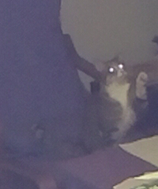

## Is Raerae Hungry?

My cat has gotten in the habit of raising her left paw at me as a demand for food. I have not trained my cat in any way and know nothing about cat training, so it would only be appropriate to say that she has trained me to be so attentive to her gestures that I would eventually write a classifier to watch her paw-raising behavior as well.

Initial model is a CNN with two convolutional layers, two pooling layers, and two fully connected non-linear layers trained on around 1600 images from my kitchen camera.
